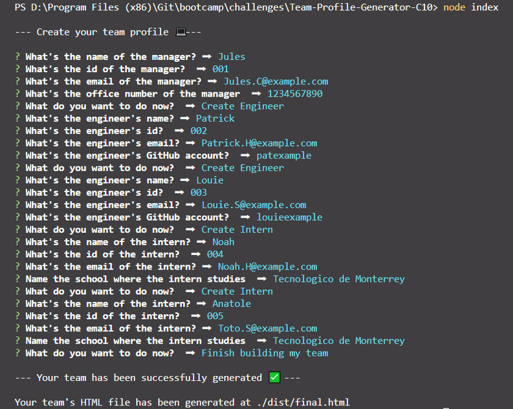
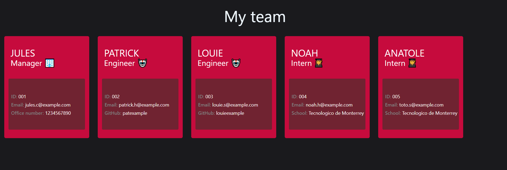

# Team-Profile-Generator-C10 []

## Description
This is a command-line application that takes in information about employees on a software engineering team and generates an HTML webpage that displays summaries for each person.

## Video
[Walkthrough Video](https://drive.google.com/file/d/1eE0myx0rmgFO20e2tH2b_Fl4EKEJyGUx/view?usp=sharing)

  ## Table of Contents

  - [Usage](#usage)
  - [Technologies](#technologies)
  - [License](#license)
  - [Tests](#tests)
  - [Questions](#questions)

## Usage
Open integrated command-line -> node index -> create your team profile -> open the generate html file

## Technologies
- HTML
- CSS
- Tailwind
- Javascript
- Node.js
- Inquirer
- Jest*

## License
[]

## Tests
WIP 🚧

## Questions
Github: <https://github.com/AndyAnza> 